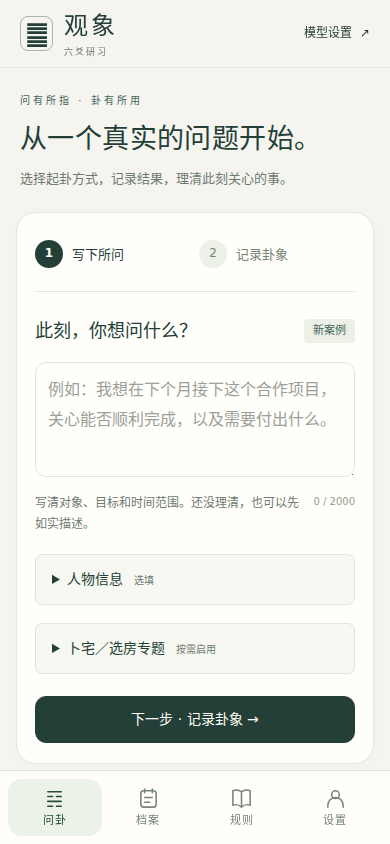
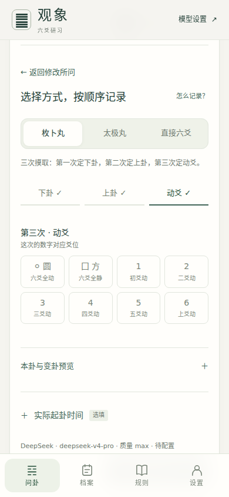
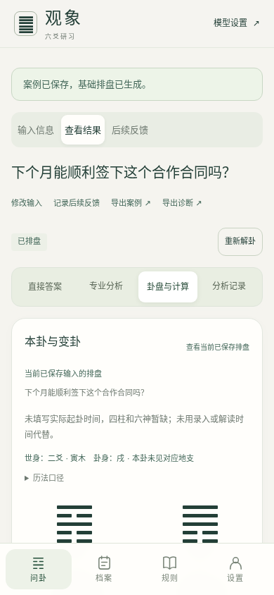
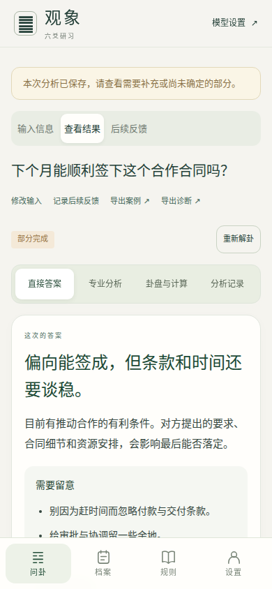
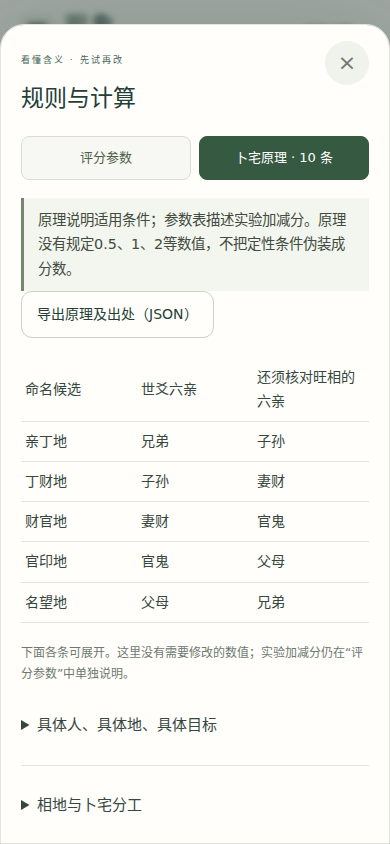
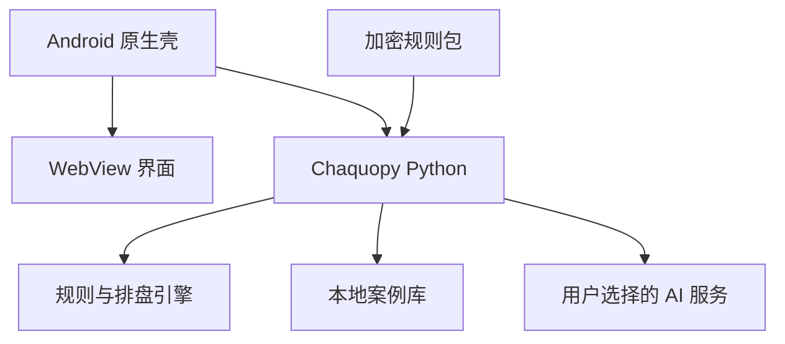

# 观象 · 六爻占问 Android

一款面向传统六爻学习与案例复盘的 Android 应用。程序在手机本地完成起卦记录、排盘、规则计算、人物档案与案例管理，并可选连接用户自己的模型服务，分阶段生成辅助解读。

项目将**确定性排盘与规则计算**和**模型语言分析**分开：卦象、干支、六亲、世应、动变及评分明细由程序生成，AI 只在这些结构化结果之上进行归纳和表达。

> 公开仓库不包含作者的真实规则表、编译结果或历史版本。首次使用须导入单独取得的 `.lyrules` 加密规则包；AI 提示词与应用源码保持公开。

> 本项目用于传统文化学习、软件工程实践与案例整理，不构成医疗、法律、投资或其他专业决策建议，也不承诺占断准确率。

## 界面预览

<table>
  <tr>
    <td align="center"><br>填写所问</td>
    <td align="center"><br>记录卦象</td>
    <td align="center"><br>卦盘与计算</td>
  </tr>
  <tr>
    <td align="center"><br>分析结果</td>
    <td align="center"><br>规则与计算</td>
  </tr>
</table>

截图来自受控演示案例，不包含真实 API 密钥或个人案例数据。

## 主要能力

### 起卦与排盘

- 支持枚卜丸、太极丸和直接六爻三种录入方式
- 按初爻到上爻保存原始输入，并生成本卦、变卦、动爻与逐爻结构
- 计算干支、六亲、世应、卦身、旺衰、合冲刑害等基础信息
- 起卦时间未知时保持未知，不用录入时间或午夜值代替

### 分阶段 AI 辅助

- 理解问题 → 确定取用 → 综合解卦 → 整理报告四阶段流程
- 保存每阶段完整回复、耗时、校验结果和失败原因
- 格式校验失败时可自动修复，并保留前一次草稿与校验依据
- 刷新状态只查询原任务，不重复发起模型调用
- 支持 DeepSeek 与火山方舟 / 豆包；模型名以用户账户实际可用值为准

### 案例、档案与反馈

- 本地人物档案、出生信息和八字辅助计算
- 案例保存、问题修订、历史重开、导出与后续反馈
- 原问题、分析快照和反馈采用追加式记录，避免后续修改覆盖历史
- 案例与 API 密钥默认只保存在本机，不提供中心化同步服务

### 规则与卜宅专题

- 独立规则页、原理说明、搜索及加密规则包 / Excel 导入
- 展示程序采用的评分参数、适用范围和逐项计算过程
- 卜宅专题按需启用，并保留独立的主问引导与评分说明

## 系统架构



- Android 原生层负责生命周期、通知、文件选择器和密钥安全存储。
- WebView 只加载应用内的本地页面资源。
- Python 服务仅绑定 `127.0.0.1`，启动入口和后续请求均有私有凭据保护。
- API 密钥由 Android Keystore 加密保存，通过原生层传入 Python 进程，不写入网页代码、案例导出或 Git 仓库。

## 技术栈

| 层级 | 技术 |
| --- | --- |
| Android | Java、Android Gradle Plugin 8.9.2、Gradle 8.13 |
| Python 嵌入 | Chaquopy 17.0.0、Python 3.12 |
| 界面 | 本地 WebView、HTML / CSS / JavaScript |
| 本地服务 | Python HTTP Server，仅监听回环地址 |
| 数据 | SQLite、JSON、加密规则包 / Excel |
| AI 适配 | DeepSeek API、火山方舟 / 豆包 API |
| 规则与历法 | 项目规则引擎、内置 `lunar_python` 兼容代码 |

## 项目结构

```text
.
├── android/                    # Android 工程与资源打包脚本
│   ├── app/                    # 原生代码、资源与确定性 payload
│   ├── tests/                  # WebView / 请求流程检查脚本
│   └── web/                    # 兼容旧 WebView 的编译后脚本
├── liuyao_app/                 # Python 应用、规则计算与本地服务
├── knowledge_base/             # 公开字段结构与脱敏 XLSX 模板
├── software_prep/              # 基础排盘、案例契约与数据校验
├── tools/                      # 规则包加密、解密工具
├── docs/                       # 设计、迁移、规则及测试文档
└── .env.example                # 配置字段示例，不含真实密钥
```

## 规则包与公开范围

公开仓库明确排除以下真实规则资产：

- `knowledge_base/rules.xlsx`
- `knowledge_base/compiled_rules.json`
- `knowledge_base/versions/`
- 表格检查记录及包含上述文件的旧资源包

应用在没有规则时仍可启动，但会显示“尚未安装规则包”，排盘和解卦接口在安装前保持锁定。取得规则包后，进入“规则”页面，选择 `.lyrules` 文件并输入提供者单独发送的口令即可安装；本机 XLSX 也可直接导入。

`.lyrules` 使用 AES-256-GCM 加密，口令通过 PBKDF2-HMAC-SHA-256（310,000 次、随机盐）派生，且每个包使用独立随机向量。口令不写入规则包、APK 或仓库。建议规则包与口令通过不同渠道发送。

这项设计用于避免规则随公开源码或普通文件传输直接泄露。获得口令并成功导入的人，仍可在其设备内使用和查看规则；它不是阻止授权接收者逆向的 DRM。

### 生成加密规则包

真实 XLSX 仅在仓库外操作：

```bash
node tools/rule-package.mjs password ../规则包口令.txt
LIUYAO_RULE_PASSWORD_FILE=../规则包口令.txt node tools/rule-package.mjs encrypt /private/path/rules.xlsx ../六爻正式规则.lyrules
```

PowerShell：

```powershell
node tools/rule-package.mjs password ..\规则包口令.txt
$env:LIUYAO_RULE_PASSWORD_FILE="..\规则包口令.txt"
node tools/rule-package.mjs encrypt C:\private\rules.xlsx ..\六爻正式规则.lyrules
Remove-Item Env:LIUYAO_RULE_PASSWORD_FILE
```

`.lyrules` 已被 Git 忽略，不应提交到公开仓库。

## 从源码构建

### 1. 环境要求

- JDK 17
- Python 3.12
- Android SDK Platform 35
- Android Build Tools 35.0.0
- Node.js（仅在修改网页 JavaScript 后需要）

### 2. 准备网页资源

只有修改了 `liuyao_app/static/*.js` 时才需要重新编译：

```bash
cd android
npm ci
npm run build:web
cd ..
```

### 3. 生成 Android 内置资源

```bash
python android/prepare.py
```

公开仓库没有展开提交数百个二进制时区文件；`prepare.py` 会从当前 `android/app/src/main/assets/content.zip` 复用时区数据库，再把 Python、公开规则结构和网页资源重新打包。生成的资源包不含真实规则表或编译规则。请勿在没有替代时区数据的情况下删除该归档。

### 4. 配置 Android SDK

在本机创建不提交的 `android/local.properties`：

```properties
sdk.dir=/path/to/Android/Sdk
```

也可以使用 `ANDROID_HOME` 环境变量。

### 5. 构建调试版

```bash
cd android
./gradlew assembleDebug
```

Windows 使用：

```powershell
cd android
.\gradlew.bat assembleDebug
```

## 发布签名

仓库不包含签名文件、密码或已签名 APK。构建独立安装版本前，在本机设置：

| 环境变量 | 作用 |
| --- | --- |
| `LIUYAO_KEYSTORE` | Keystore 本机路径 |
| `LIUYAO_STORE_PASSWORD` | Keystore 密码 |
| `LIUYAO_KEY_ALIAS` | 密钥别名，默认 `liuyao` |
| `LIUYAO_KEY_PASSWORD` | 密钥密码；未设置时沿用仓库密码 |

然后运行：

```bash
cd android
./gradlew -PseparateInstall=true assembleRelease
```

`separateInstall=true` 使用应用 ID `cn.guanxiang.liuyao.study` 和名称“观象研习”；不传时使用 `cn.guanxiang.liuyao`。升级已有安装必须保持相同应用 ID、签名证书，并递增 `versionCode`。

## AI 配置与隐私

安装后从“模型设置”填写自己账户的 API 密钥。`.env.example` 只说明字段，不包含真实值；Android 版本以应用内 Keystore 配置为准。

公开提交前请确认没有加入：

- `.env`、`local.properties`
- Keystore、证书私钥或密码
- APK / AAB 构建产物
- 真实人物档案、案例数据库或导出文件
- 付费模型的原始响应日志

应用卸载会清除内部数据；重要案例应先导出备份。

## 测试

不依赖私有规则内容的基础检查：

```bash
python software_prep/run_checks.py
```

完整规则相关测试须由规则维护者在仓库外临时提供真实规则文件后运行；公开仓库不会为了测试重新附带规则明文。

网页资源与公开 payload 一致性：

```bash
cd android
npm ci
npm run build:web
cd ..
python android/prepare.py
```

最新复核结果与已知限制见 [`docs/TEST_RESULTS.md`](docs/TEST_RESULTS.md)。

## 当前状态

- 最低 Android 版本：Android 8.0（API 26）
- 目标 API：35
- ABI：`arm64-v8a`、`x86_64`
- 基础检查与资源打包可离线运行，不调用收费 API
- 真实规则须通过仓库外的加密包单独授权
- 尚未把浏览器替身测试等同于 Android 真机验收
- 尚未进行真实付费模型的端到端验收

## 第三方代码与使用授权

`liuyao_app/_vendor/lunar_python/` 保留其原始许可证和 NOTICE。仓库当前未附项目级开源许可证；公开可见不等于自动授予复制、修改或商业使用权限。
